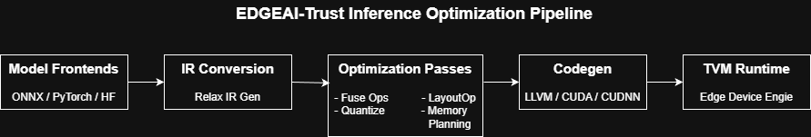

# 📘 EDGEAI-Trust Inference Optimization Pipeline

<div align="center">
</img>
<h2></h2>

<h2></h2>
</div>

<p align="center">
  <a href="#"></a>
  <a href="#"></a>
  <a href="#"></a>
  <a href="#"></a>
  <a href="#"></a>
  <a href="#"></a>
</p>

# EDGEAI-Trust Inference Optimization Pipeline

The **EDGEAI-Trust Inference Optimization Pipeline** is a unified benchmarking and optimization framework designed for **model inference across CPU and GPU backends**, including:

- **ONNX Runtime (CPU / CUDA)**
- **Apache TVM (CPU / CUDA)**
- **NVIDIA TensorRT (FP32 / FP16)**


---

## Key Features

### Inference Benchmarking
- ONNX Runtime (CPU & CUDA)
- TVM CPU + CUDA Relax pipeline
- TensorRT FP32 + FP16 execution

### Model Normalization Pipeline
- Converts FP16 → FP32 initializers  
- Safe ONNX Opset upgrade (default 13)  
- ONNX shape inference  
- Outputs clean “normalized” model for all backends

### Performance Evaluation
- Unified warmup + benchmark loops  
- Per-backend latency tables  
- Speedup ratio calculations  
- Model size reporting  

### TVM Integration
- Relax IR import (`from_onnx`)
- Device planning + parameter binding
- Meta-schedule tuning (optional)
- Autoscheduler fallback
- Safe GPU scheduling with DefaultGPUSchedule

### TensorRT Support
- Modern explicit batch network parsing
- FP16 engine builder with fallback
- pycuda-based execution timing  
- Dynamic shape handling

---

# 📂 Repository Structure

```
.
├── benchmark.py        # Main ONNX benchmark runner
├── build_tvm.sh        # Automated TVM rebuild script
├── tvm_check.py        # TVM validation tool
├── tests/              # Test assets and utilities
├── .gitignore
└── README.md
```

---

# 🛠 Installation

Clone the repository:

```bash
git clone https://github.com/CaffeineOverflowAngeL/EDGEAI-Trust-Inference-Optimization.git
cd EDGEAI-Trust-Inference-Optimization
```

Create a Python environment:

```bash
python3 -m venv edgeai_venv
source edgeai_venv/bin/activate
```

Install dependencies:

```bash
pip install -r requirements.txt
```

GPU acceleration requires:
- CUDA  
- cuDNN  
- TensorRT (optional)  
- TVM built with CUDA  

---

# ⚡ Quickstart

### Basic Usage

```bash
python benchmark.py --model path/to/model.onnx
```

### Override Input Shape

```bash
python benchmark.py --input-shape "[1,3,224,224]"
```

### Disable Specific Backends

```bash
python benchmark.py --no-tvm
python benchmark.py --no-trt
```

### Increase TVM Tuning Effort

```bash
python benchmark.py --tuning-trials 5000
```

### Override Opset Upgrade

```bash
python benchmark.py --opset 17
```

---

# ⚙️ Benchmark Architecture

<div align="center">

</div>

## Model Normalization

1. Converts FP16 → FP32 initializers  
2. Upgrades ONNX opset  
3. Runs ONNX shape inference  
4. Saves normalized model as:  
   `model_opsetX_shaped.onnx`

Purpose: guarantee consistent behavior across ORT, TVM, and TensorRT.

## ORT Benchmarking

- Optimized SessionOptions  
- CPUExecutionProvider  
- CUDAExecutionProvider (if available)  
- Warmup + timed runs  
- Millisecond-level latency reporting  

## TVM Benchmarking (Relax)

Pipeline includes:
- LegalizeOps  
- BindParams  
- AnnotateTIROpPattern  
- PlanDevices / RealizeVDevice  
- FuseTIR  
- Meta-schedule tuning (if enabled)  
- DefaultGPUSchedule fallback  
- Execution through Relax VirtualMachine  

## TensorRT Benchmarking

Stages:
1. Load ONNX + parse  
2. Build FP32 engine  
3. Attempt FP16 engine (fallback-safe)  
4. Allocate device buffers  
5. Run warmup  
6. Time repeated inference  
7. Report ms-level latency  

---

# 🔨 TVM Build Tool

Use the provided script:

```bash
chmod +x build_tvm.sh
./build_tvm.sh
```

This script:
- Rebuilds TVM from source (CUDA + LLVM)
- Installs Python bindings (`pip install -e .`)
- Logs everything to `~/tvm_rebuild_*.log`
- Validates:
  - TVM version  
  - CUDA availability  
  - Relax transforms  

Validate installation:

```bash
python tvm_check.py
```

---

# 📊 Example Output

```
📊 Final Performance Report
-------------------------------------------------------------
Backend                | Latency (ms) | Speedup | Size (MB)
-------------------------------------------------------------
ORT Baseline (CPU)     |      5.05    |   1.00× |  42.51
ORT GraphOpt (CPU)     |      3.80    |   1.33x |  42.51
TVM (CPU)              |      4.95    |   1.02× |  42.51
-------------------------------------------------------------
ORT (CUDA)             |      1.10    |   1.09× |  42.51
TVM (CUDA)             |      1.15    |   1.04× |  42.51
TensorRT (FP32)        |      0.46    |   2.61× |  42.51
TensorRT (FP16)        |      0.37    |   3.24× |  42.51
-------------------------------------------------------------
```

---

# 🔧 Troubleshooting

### TensorRT ParseError
- Ensure ONNX opset ≤ TensorRT version  
- Enable shape inference  
- Ensure dynamic axes are compatible  

### TVM CUDA Not Enabled
Check with:
```python
import tvm
tvm.cuda().exist
```

### ORT CUDA Missing
Install CUDA-enabled ONNX Runtime:
```bash
pip install onnxruntime-gpu
```

---

# 📄 License

This project is licensed under the **MIT License**.

---

# 📬 Contact

For issues, feature requests, or discussions — open an issue in this repository.
